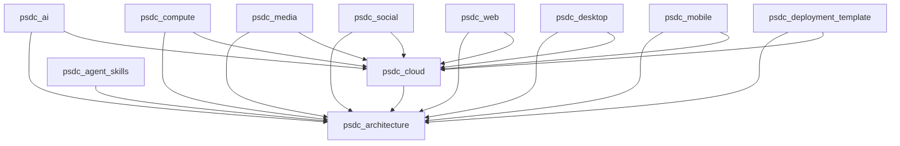

# Repository and Dependency Catalog

> Generated from `repos.yaml`; edit the catalog, not this view.

| Repository | Role | Lifecycle | Required dependencies | Provides |
|---|---|---|---|---|
| psdc-architecture | normative_architecture_and_contracts | specification | none | decision.register.v1, contract.catalog.v1 |
| psdc-cloud | institutional_cloud_control_plane | specification | psdc-architecture | cloud.resource.v1, cloud.service.v1, identity.verify.v1 |
| psdc-ai | institutional_ai_control_plane | specification | psdc-architecture, psdc-cloud | ai.session.v1, ai.route.v1 |
| psdc-compute | sovereign_compute_and_storage_fabric | specification | psdc-architecture, psdc-cloud | workload.submit.v1, lease.manage.v1, object.retrieve.v1 |
| psdc-media | media_and_spatial_fabric | specification | psdc-architecture, psdc-cloud | media.asset.v1, spatial.scene.v1 |
| psdc-social | federated_social_fabric | specification | psdc-architecture, psdc-cloud | activitypub.actor.v1, social.policy.v1 |
| psdc-web | browser_client | specification | psdc-architecture, psdc-cloud | client.web.v1 |
| psdc-desktop | desktop_client | specification | psdc-architecture, psdc-cloud | client.desktop.v1 |
| psdc-mobile | mobile_client | specification | psdc-architecture, psdc-cloud | client.mobile.v1 |
| psdc-deployment-template | institution_deployment_overlay_template | specification | psdc-architecture, psdc-cloud | deployment.manifest.v1, policy.binding.v1 |
| psdc-agent-skills | governed_agent_skills_and_assessment | specification | psdc-architecture | assessment.result.v1, skill.registry.v1 |

## Required dependency graph

